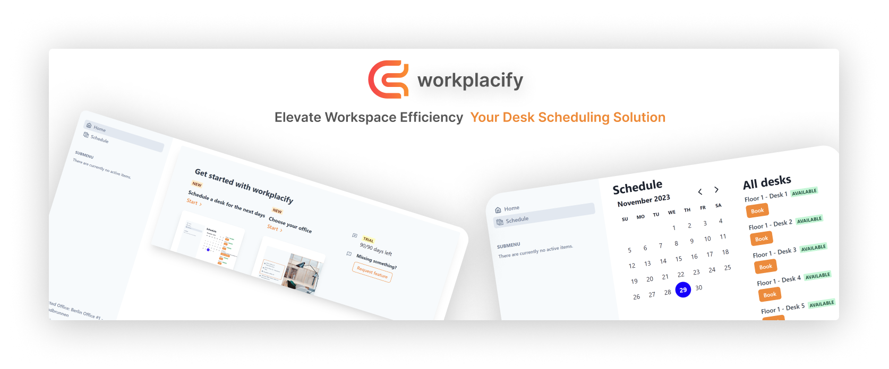
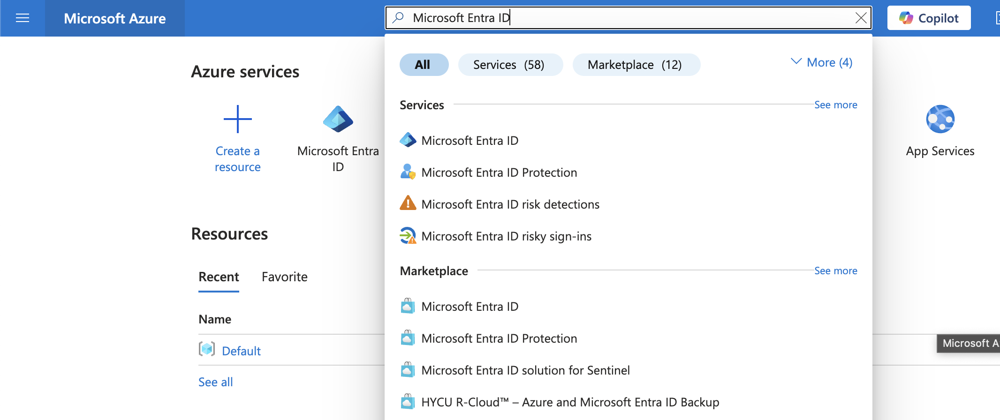

# workplacify

The open-source desk scheduling app for your office. [Learn more](https://workplacify.com).

<div align="center">

[Discord](https://discord.gg/MeNJDkKmBb) · [Website](https://workplacify.com) · [Issues](https://github.com/igeligel/workplacify/issues)

</div>



## About the Project

We are the first open-source desk scheduling app for your office. Ever had conflicting desk schedules or an employee not getting their favorite desk? Tracking your desks in an Excel sheet? Use workplacify to manage your office desks and make your employees happy. A perfect alternative to Envoy, UnSpot, Flexopus or desk.ly.

### Built With

- [Next.js](https://nextjs.org/?ref=workplacify.com)
- [tRPC](https://trpc.io/?ref=workplacify.com)
- [React.js](https://reactjs.org/?ref=workplacify.com)
- [Chakra UI](https://chakra-ui.com/?ref=workplacify.com)
- [Prisma](https://prisma.io/?ref=workplacify.com)

## Contact us

Meet us on [Discord](https://discord.gg/m6EQptpj) or [schedule a meeting](https://calendar.app.google/8pcg6kcqXvuyVPyq8) with the founder.

## Development

### Setup

1. Fork the repository: https://github.com/igeligel/workplacify/fork and clone it to your local machine:
   ```sh
   git clone https://github.com/<your_username>/workplacify
   ```
1. Go to the project directory:
   ```sh
   cd workplacify
   ```
1. Install packages with npm
   ```sh
   npm install
   ```
1. Set up your `.env` file:
   - Duplicate `.env.example` to `.env`
   - Create a new `NEXTAUTH_SECRET`, for example via: https://bitwarden.com/password-generator/
   - Generate the `GOOGLE_CLIENT_ID` and `GOOGLE_CLIENT_SECRET` via https://console.cloud.google.com/apis/credentials
   - If you want to use Microsoft as a login method, generate the `MICROSOFT_ENTRA_CLIENT_ID`, `MICROSOFT_ENTRA_CLIENT_SECRET`, and `MICROSOFT_ENTRA_TENANT_ID` via https://portal.azure.com/
   - Generate the `CLOUDINARY_API_SECRET`, `CLOUDINARY_API_KEY`, and `CLOUDINARY_NAME` via https://cloudinary.com/console
1. Setup Node If your Node version does not meet the project's requirements as instructed by the docs, "[nvm](https://github.com/nvm-sh/nvm)" (Node Version Manager) allows using Node at the version required by the project. You can also use [nvm-windows](https://github.com/coreybutler/nvm-windows). We are currently using Node.js 20.
1. Start the database & development server:
   ```sh
   npm run db-up
   npm run dx
   ```
1. Once starting you also should see an example organization id which you can join which has some static data already.

## Deployment

Deployment is done via [render.com](https://render.com). You can deploy your own instance by clicking the button below:

[](https://render.com/deploy)

## Contributing

We are still working on our contributing guide but feel free to open a PR or issue if you see something or want to request a feature.

<!-- ### Hacktoberfest

We will be active maintainers during the [Hacktoberfest](https://hacktoberfest.com/). In 2024 we will focus on this. -->

## Integrations

We are having some integrations of which some are necessary to run the application.

### Google OAuth

We use Google as the main auth provider. You can create your own OAuth credentials via https://console.cloud.google.com/apis/credentials. These credential can be then added to the `.env` file.

### Microsoft Entra OAuth

You can use Microsoft Entra as an auth provider.

You can create all the necessary credentials via the [Azure Portal](https://portal.azure.com). Check for `Microsoft Entra ID` in the search bar and select it.



On the next page, select "Add" and then "App Registrations" and then fill out the details. In the "Supported account types" section, choose:

- Accounts in this organizational directory only (Standardverzeichnis only - Single tenant) or
- Accounts in any organizational directory (Any Microsoft Entra ID tenant - Multitenant) and personal Microsoft accounts (e.g. Skype, Xbox)

For the "Redirect URI (optional)", select "Web" and enter the following URL: `https://127.0.0.1:3000/api/auth/callback/microsoft-entra-id`. Or when you self-host: `https://your-domain.com/api/auth/callback/microsoft-entra-id`. The path is the important part here: `/api/auth/callback/microsoft-entra-id`.

Once created you need to find certain values and add them to the `.env` file:

| Environment Variable            | Microsoft Entra ID lookup                                                                                                                   |
| ------------------------------- | ------------------------------------------------------------------------------------------------------------------------------------------- |
| `MICROSOFT_ENTRA_CLIENT_ID`     | `Application (client) ID`                                                                                                                   |
| `MICROSOFT_ENTRA_CLIENT_SECRET` | Under `Client credentials`, you will see `0 certificate, 1 secret` or similar. If not click on it and get a client secret.                  |
| `MICROSOFT_ENTRA_ISSUER`        | This is an URL that includes your `Directory (tenant) ID`. Its the format `https://login.microsoftonline.com/{Directory (tenant) ID}/wsfed` |

### Cloudinary

We are using cloudinary to save images of the floor. We currently do not have other providers to save the image, but we might work on this in the future. You can create your own Cloudinary credentials via https://cloudinary.com/console. These credential can be then added to the `.env` file.

### Discord (for notifications)

Discord is fully optional but we use it to notify the team around issues, or events that are happening on the platform, to interact with new users for example. You can create your own Discord bot via https://discord.com/developers/applications. These credential can be then added to the `.env` file.

## License

The code is licensed under the [MIT License](./LICENSE) mostly. Some parts are currently licensed under different licenses because they are commercial projects:

- Chakra Starter: [PolyForm Strict License 1.0.0](./src/chakra-starter/LICENSE.MD)

## Acknowledgements

None so far!
